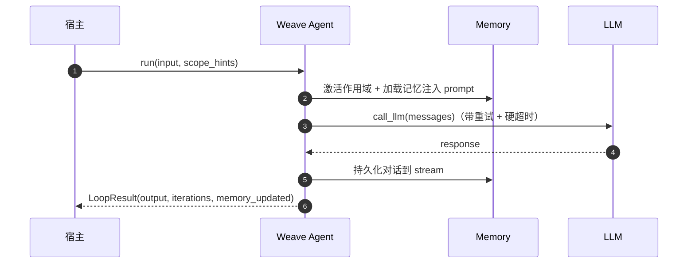
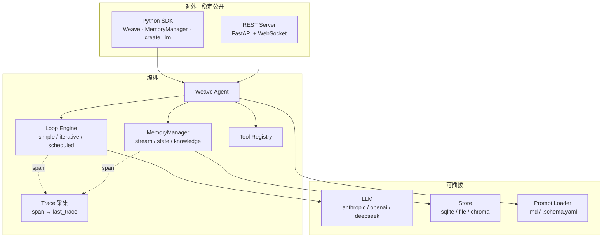

# Weave

> 非侵入式 Agent SDK —— 三个可独立使用的能力：**编排**（Loop）、**LLM 管理**、**Memory 记忆**。

<p align="left">
  
  
  
</p>

**Weave** 把一个纯「请求-响应」的项目，变成一个「能迭代、能记住」的 Agent，只需 **5 行代码**。

- 🧩 **非侵入式** —— `pip install` + `import`，宿主业务代码一行不动
- 🧩 **三能力独立** —— 编排 / LLM / Memory 可单独拿走用，不必整套绑一起
- 🔌 **可插拔** —— Loop / LLM / Memory 后端均可注册扩展

---

## 目录

- [快速开始](#快速开始)
- [三大能力](#三大能力)
  - [① 编排 `Weave`](#①-编排-weave)
  - [② LLM 管理 `create_llm`](#②-llm-管理-create_llm)
  - [③ Memory 记忆 `MemoryManager`](#③-memory-记忆-memorymanager)
- [架构](#架构)
- [可插拔扩展](#可插拔扩展)
- [配置](#配置)
- [示例](#示例)
- [文档](#文档)
- [License](#license)

---

## 快速开始

### 安装

```bash
pip install weave-agent-sdk           # 核心（仅依赖 PyYAML）
pip install "weave-agent-sdk[all]"    # 含 anthropic / openai / chromadb / fastapi
```

### 脚手架（最快起步）

```bash
weave init my_agent          # 生成最小可跑通的项目骨架
cd my_agent
python agent.py              # 直接跑
```

### 5 行代码

```python
from weave_agent_sdk import Weave

weave = Weave()                                       # 零配置（凭证从环境变量读取）

@weave.tool(name="search", description="搜索")
def search(query: str) -> str:
    return f"搜索结果：{query}"

result = weave.run("我应该学什么？")
print(result.output)
```

---

## 三大能力

### ① 编排 `Weave`

把 LLM + Memory 串起来跑一个 agent：加载记忆 → 注入 prompt → 调 LLM →（调工具）→ 持久化对话。

```python
from weave_agent_sdk import Weave

weave = Weave()                    # 零配置 / Weave("weave.yaml") / Weave(config=WeaveConfig(...))

@weave.tool                        # 注册工具（name / description / schema）
def search(q: str) -> str: ...

result = weave.run("问题")          # 同步；arun() 异步；stream() 流式
```

| 能力 | 说明 |
|------|------|
| Loop 策略 | `simple`（一问一答）/ `iterative`（反复调工具）/ `scheduled`（cron 定时） |
| 记忆编排 | run 时自动加载 `stream`/`state`/`knowledge` 注入 prompt，run 后自动持久化对话 |
| 状态回滚 | `weave.checkpoint()` 打快照 / `weave.rollback()` 回滚 |
| 可观测 | `weave.last_trace` 本次 run 完整链路（每轮注入了什么、LLM 看到了什么、工具怎么执行） |
| 运行状态 | `weave.status()` / `weave.memory`（同步读写记忆） |

运行流程：



### ② LLM 管理 `create_llm`

多 provider + 鉴权 + 模型解析，**无状态**（不绑对话上下文，上下文归 Memory / 宿主管）。

```python
from weave_agent_sdk.llm.factory import create_llm
from weave_agent_sdk.types import Message

llm = create_llm(provider="deepseek")                  # anthropic / openai / deepseek
resp = await llm.chat([Message(role="user", content="...")])
print(resp.content)     # 文本；resp.tool_calls / usage / finish_reason
```

- 凭证从**标准环境变量**读取（`ANTHROPIC_API_KEY` / `OPENAI_API_KEY` / `DEEPSEEK_API_KEY`），零硬编码。
- 模型名经 `WEAVE_MODEL` / `{PROVIDER}_MODEL` 解析；provider 与模型明显不匹配会告警。
- 流式 `chat_stream()` 逐 token；非流式 `chat()` 一次拿全。

### ③ Memory 记忆 `MemoryManager`

存储 + 隔离，**可脱离编排独立使用**（只借单表 + namespace 隔离，不要单 agent 循环）。

```python
from weave_agent_sdk import MemoryManager, MemoryConfig

mem = MemoryManager(MemoryConfig(default_backend="sqlite", default_path="./data.db"))
mem.state.set("k", "v", "s:1:state")                    # 键值，覆盖
mem.stream.append({"role": "user", "content": "hi"}, "s:1:stream")  # 时序流，追加
mem.knowledge.add("知识片段", "kb:1:knowledge")           # 知识，追加 + 搜索
```

三种访问模式（同一张表上的三种读写方式，不是三套存储）：

| 模式 | 操作 | 语义 |
|------|------|------|
| `stream` | `append` / `last(N)` / `trim` | 时序流，追加，按时间取最近 N 条 |
| `state` | `set` / `get` / `delete` / `get_all` | 键值，新值覆盖旧值 |
| `knowledge` | `add` / `search(query, top_k)` | 追加不覆盖，关键词搜索（chroma 后端为语义） |

**namespace 隔离**：格式 `{scope_name}:{scope_id}:{access_type}`，`access_type` 恒为最后一段，`scope_id` 可含冒号。

```
session:abc123:stream      → session abc123 的对话流
domain:recsys:state        → "推荐系统" 领域的状态
kb_global:default:knowledge → 全局知识库
```

在编排中，作用域由 `scope_hints` 传入 `run()` 自动隔离（`{"session_id": "A"}` 与 `{"session_id": "B"}` 互不可见）；独立使用时直接手写 namespace 字符串。

---

## 架构



**规则**：上层依赖下层，下层不感知上层；Adapter 可平行扩展，Core 接口不变。
虚线 `-.span.->` 表示 span 上报（可观测，非依赖）。

---

## 可插拔扩展

内置实现是「预注册的默认值」，宿主可注册自定义实现并经配置引用：

```python
from weave_agent_sdk import register_llm, register_loop, register_memory_backend

register_llm("my_gateway", my_gateway_factory)       # llm.provider: my_gateway
register_loop("human_review", HumanReviewLoop)        # loop.type: human_review
register_memory_backend("redis", RedisBackend)        # backend: redis
```

或运行期注入（离线 / 测试）：

```python
weave = Weave("weave.yaml", llm=FakeLLM())   # 不碰内部属性，直接注入
```

扩展点抽象（深层模块）：

| 扩展什么 | 抽象 | 导入 |
|---------|------|------|
| 自定义 Loop | `BaseLoop` | `weave_agent_sdk.loop.base` |
| 自定义 LLM | `BaseLLM` | `weave_agent_sdk.llm.base` |
| 自定义 Memory 后端 | `StreamMemory` / `StateMemory` / `KnowledgeMemory` | `weave_agent_sdk.memory.base` |
| REST 服务 | `create_app` | `weave_agent_sdk.server` |

---

## 配置

```yaml
llm:
  provider: anthropic                  # anthropic | openai | deepseek
  model: ${WEAVE_MODEL:-claude-sonnet-5-20251001}

loop:
  type: iterative                      # simple | iterative | scheduled
  max_iterations: 10

memory:
  scopes:
    session:                           # 项目自定义作用域
      stream: { backend: sqlite }
      state:  { backend: sqlite }

prompts:
  system: prompts/system.md            # prompt 从文件加载，模板变量注入
```

> 所有凭证从**标准环境变量**读取，代码与配置中零硬编码。
> 完整配置项见 [`docs/config-reference.yaml`](docs/config-reference.yaml)。

---

## 示例

仓库 `demo/` 内附可运行的**三人设对话 Demo**：三个人设共享同一份客观上下文，各自记忆隔离。

```bash
cd demo
python main.py           # 离线（FakeLLM，无需 API Key）
python main.py --real    # 真实模型
```

---

## 文档

| 文档 | 内容 |
|------|------|
| [`docs/public-api.md`](docs/public-api.md) | 稳定公开 API 清单 + 契约 |
| [`docs/config-reference.yaml`](docs/config-reference.yaml) | 完整配置参考 |
| [`docs/basic.md`](docs/basic.md) | 基础事实与约束（设计红线） |
| [`docs/internal-utilities.md`](docs/internal-utilities.md) | 内部非功能工具 |
| [`DESIGN.md`](DESIGN.md) | 完整设计文档 |
| [`docs/issues/`](docs/issues/) | 设计决策记录 |

---

## License

[MIT](LICENSE) © Weave Contributors
