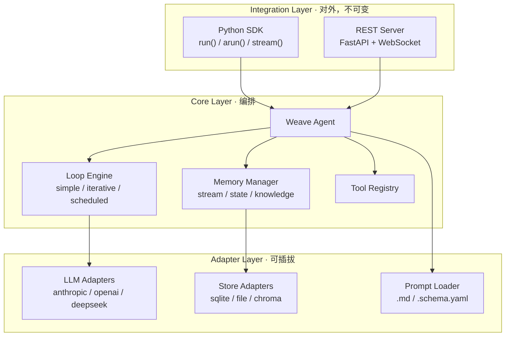
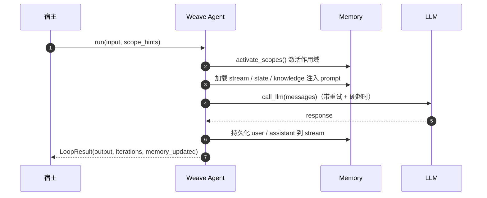

# Weave

> 非侵入式、基于 SDK 的 Agent 插件框架 —— 只做两件事：**Loop（循环）** 与 **Memory（记忆）**。

<p align="left">
  
  
  
</p>

**Weave** 把一个纯「请求-响应」的项目，变成一个「**能迭代、能记住**」的 Agent，只需 **5 行代码**。

- 🧩 **非侵入式** —— `pip install` + `import` + 配置，宿主业务代码一行不动
- 🔌 **可插拔** —— Loop / LLM / Memory 后端均可注册扩展
- 🧠 **三级记忆** —— `stream`（会话）· `state`（状态）· `knowledge`（知识），namespace 行级隔离
- 🌐 **SDK 与 REST 同一抽象** —— `weave.run("...")` ≡ `POST /agents/default/run`

---

## 目录

- [快速开始](#快速开始)
- [核心概念](#核心概念)
- [架构](#架构)
- [特性一览](#特性一览)
- [可插拔扩展](#可插拔扩展)
- [运行流程](#运行流程)
- [示例](#示例)
- [文档](#文档)
- [License](#license)

---

## 快速开始

### 安装

```bash
pip install -e .            # 核心（仅依赖 PyYAML）
pip install -e ".[all]"     # 含 anthropic / openai / chromadb / fastapi
```

### 5 行代码

```python
from weave import Weave

weave = Weave("weave.yaml")          # 1. 加载配置

@weave.tool                          # 2. 注册你的工具
def search(query: str) -> str:
    return f"搜索结果：{query}"

result = weave.run("我应该学什么？")   # 3. 跑起来
print(result.output)
```

### 配置 `weave.yaml`

```yaml
llm:
  provider: anthropic                  # anthropic | openai | deepseek
  model: ${WEAVE_MODEL:-claude-sonnet-5-20251001}

loop:
  type: iterative                      # simple | iterative | scheduled
  max_iterations: 10

memory:
  scopes:
    session:                           # 项目自定义作用域
      stream: { backend: sqlite }
      state:  { backend: sqlite }

prompts:
  system: prompts/system.md            # prompt 从文件加载，模板变量注入
```

> 所有凭证从环境变量读取，代码与配置中**零硬编码**（API Key / Prompt / 模型名）。

---

## 核心概念

### Loop —— 三种循环策略

| 策略 | 行为 | 适用场景 |
|------|------|---------|
| `simple` | 一次请求 → 一次响应，不调工具 | 问答、翻译、摘要 |
| `iterative` | LLM 反复调用工具直到停止条件 | 工具调用、多步推理 |
| `scheduled` | cron / 事件驱动，定时自动执行 | 监控、定期扫描 |

### Memory —— 三种访问模式

| 模式 | 操作 | 比喻 |
|------|------|------|
| `stream` | `append` / `last(N)` / `trim` | 对话历史，时序流 |
| `state` | `set` / `get` / `delete` / `get_all` | 键值状态，新值覆盖旧值 |
| `knowledge` | `add` / `search(query, top_k)` | 知识库，追加不覆盖，语义搜索 |

### Namespace 隔离

作用域由**项目自定义**，格式 `{scope_name}:{scope_id}:{access_type}`，单表行级隔离：

```
session:abc123:stream     → session abc123 的对话流
domain:recsys:state       → "推荐系统" 领域的状态
kb_global:default:knowledge → 全局知识库
```

同一个 `Weave` 实例内，不同 `scope_hints` 天然隔离不同会话/人设的记忆——这是多租户、多人设场景的基础。

---

## 架构



**规则**：上层依赖下层，下层不感知上层；Adapter 可平行扩展，Core 接口不变。

---

## 特性一览

| 类别 | 能力 |
|------|------|
| **入口** | 同步 `run()` · 异步 `arun()` · 流式 `stream()`，签名统一 |
| **Loop** | `simple` / `iterative` / `scheduled`（cron + 事件驱动） |
| **Memory** | `stream` / `state` / `knowledge`，TTL 过期，namespace 隔离 |
| **LLM** | anthropic / openai / deepseek，流式与非流式 |
| **存储后端** | sqlite（默认，WAL）/ file / chroma（向量语义搜索） |
| **Prompt** | `.md` 模板 + `.schema.yaml` 声明式组装，变量 `{{ }}` 注入 |
| **Server** | FastAPI REST + WebSocket 流式，与 SDK 同抽象 |
| **非功能** | LLM 调用重试 / 硬超时 / Prompt 注入防御（内置接线，默认生效） |

---

## 可插拔扩展

内置实现只是「预注册的默认值」，宿主可注册自定义实现，并经配置引用：

```python
from weave import register_llm, register_loop, register_memory_backend

register_llm("my_gateway", my_gateway_factory)       # llm.provider: my_gateway
register_loop("human_review", HumanReviewLoop)        # loop.type: human_review
register_memory_backend("redis", RedisBackend)        # backend: redis
```

或运行期注入（离线 / 测试）：

```python
weave = Weave("weave.yaml", llm=FakeLLM())   # 不碰内部属性，直接注入
```

---

## 运行流程



---

## 示例

仓库 `demo/` 内附一个可运行的**三人设对话 Demo**：三个人设共享同一份客观上下文，
但各自会话、记忆、保存结果彼此隔离。

```bash
cd demo
python main.py           # 离线（FakeLLM，无需 API Key）
python main.py --real    # 真实模型
```

```
你 > 客户投诉支付成功但订单未生成，怎么办？

【理性分析者】  ……结构化五步：止血 → 定位 → 量化 → 修复 → 报告
【激进冒险者】  ……立刻回滚灰度 + 直接补单，行动导向
【保守谨慎者】  ……先冻结灰度、核对时序、逐步放量，风险优先

你 > /report            # 查看隔离证据：共享上下文 + 各人设私有记忆
```

---

## 文档

| 文档 | 内容 |
|------|------|
| [`docs/basic.md`](docs/basic.md) | 基础事实与约束（设计红线 R1–R7） |
| [`docs/public-api.md`](docs/public-api.md) | 稳定公开 API 清单 |
| [`docs/internal-utilities.md`](docs/internal-utilities.md) | 内部非功能工具（排查用） |
| [`DESIGN.md`](DESIGN.md) | 完整设计文档 |
| [`docs/issues/`](docs/issues/) | 设计决策记录（001–011） |

---

## License

[MIT](LICENSE) © Weave Contributors
