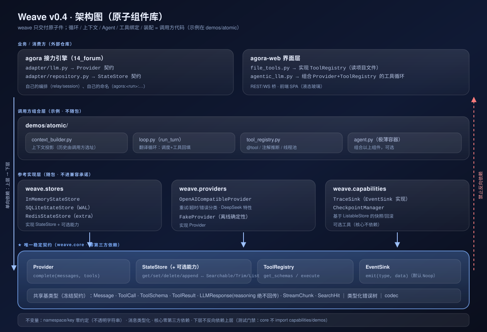
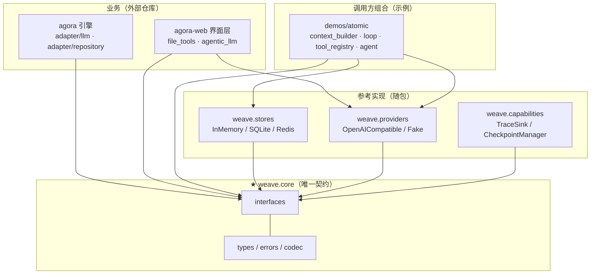
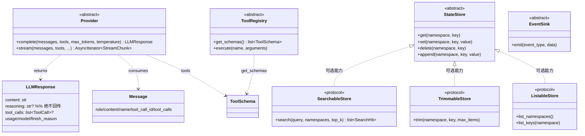
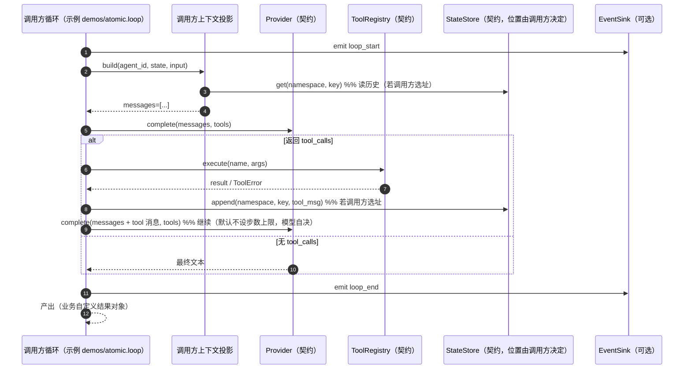
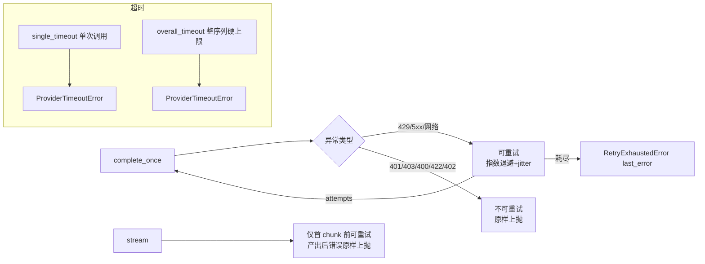
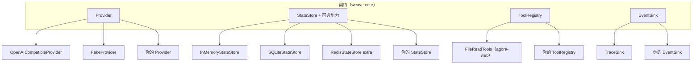

# Weave 架构图（v0.4 · 原子组件库）



> 原则：**weave 只交付原子件**；组合（循环/上下文/Agent/工具绑定/装配）是调用方代码。
> 本图与 `weave/` 实际代码一一对应；命名零约定（namespace/key 由调用方定义）。
> 相关：`docs/v0.4/01-principles.md`（先验）、`docs/v0.4/02-architecture.md`（契约细节）。

## 0. 一图看全

```
┌──────────────────────────────────────────────────────────────────────────────┐
│ 业务 / 消费方                                                                 │
│   14_forum · agora（接力引擎）       其它产品…                                │
│   ├─ adapter/llm.py      → Provider 契约                                      │
│   ├─ adapter/repository.py → StateStore 契约                                  │
│   └─ agora-web/（界面层）                                                     │
│        · file_tools.py      → 实现 ToolRegistry（业务工具：读项目文件）        │
│        · agentic_llm.py     → 组合 Provider+ToolRegistry 的工具循环            │
└───────────────▲──────────────────────────────────────────────────────────────┘
                │ 只依赖原子契约（单向；下层绝不反向 import）
┌───────────────┴──────────────────────────────────────────────────────────────┐
│ 调用方组合（示例，不随包）     13_weave/demos/atomic/                          │
│   context_builder.py（投影上下文） loop.py（翻译循环）                          │
│   tool_registry.py（@tool/推断/线程池） agent.py（极薄容器）                     │
└───────────────▲──────────────────────────────────────────────────────────────┘
                │
┌───────────────┴──────────────────────────────────────────────────────────────┐
│ 参考实现（随包，不进兼容承诺）                                                 │
│   weave.stores        InMemory / SQLite(WAL) / Redis(extra)                   │
│   weave.providers     OpenAICompatible(含 DeepSeek 特性) / Fake               │
│   weave.capabilities  TraceSink(EventSink 实现) / CheckpointManager           │
└───────────────▲──────────────────────────────────────────────────────────────┘
                │ 只实现契约，不依赖上层
┌───────────────┴──────────────────────────────────────────────────────────────┐
│ ★ weave.core —— 唯一稳定契约（零第三方依赖）                                   │
│   interfaces: Provider · StateStore(+Searchable/Trimmable/Listable) ·         │
│               ToolRegistry · EventSink(+Noop)                                 │
│   types:      Message/ToolCall/ToolSchema/ToolResult/LLMResponse/             │
│               StreamChunk/SearchHit      errors: 类型化错误树                  │
│   codec:      msg_to_dict / dict_to_msg                                       │
└──────────────────────────────────────────────────────────────────────────────┘
```

**红线（有测试保障）**：`weave.core` 不得 import `capabilities` / `demos` / 任何组合层；
`stores`/`providers`/`capabilities` 只依赖 `weave.core`；业务只依赖契约。

## 1. 依赖方向（Mermaid）



## 2. 原子契约与类型（Mermaid classDiagram）



## 3. 一次调用（由调用方组装；weave 不提供 Agent/Loop）



## 4. Provider 内部：可靠性语义（T2）



## 5. 可替换性（同一契约，多实现）



## 6. 边界与不变量

| 层 | 内容 | 稳定性 |
|---|---|---|
| 契约 | `weave.core` 接口 + 类型 + 错误 + codec | **进兼容承诺** |
| 参考实现 | stores / providers / capabilities | 不进承诺，可随包演进 |
| 调用方组合 | 循环 / 上下文投影 / Agent 容器 / 工具绑定 | 业务自定，weave 不提供 |

不变量：
1. namespace/key **零约定**（核心视为不透明字符串）；
2. 消息与响应类型化；`reasoning` 承载推理内容且**绝不回传**；
3. 核心零第三方依赖（`pyyaml` 等已随 DX 移除而移除）；
4. 下层不反向依赖上层（测试门禁：`weave.core` 不 import capabilities/demos/组合层）。

## 7. 实证锚点（本仓库真实使用）

- **agora**：只消费 `Provider` 与 `StateStore`（+ `Message`/`ToolSchema`/`ToolError`），
  weave 三次大重构期间 agora **零改动、142 测试全绿**；
- **agora-web**：`FileReadTools` 实现 `ToolRegistry`；`AgenticLLM` 用 weave 原子件组合
  工具循环（过程/结果两段输出、可控读取预算、模型自决停止）；
- **demos/atomic**：循环/上下文/Agent 全部作为"调用方代码"存在，用于说明与测试。
