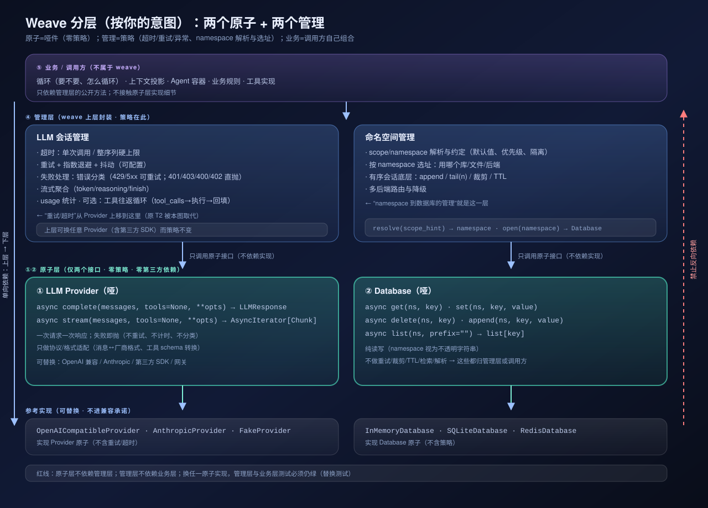

# Weave 分层（按"两原子 + 两管理"意图）



> 原子 = 哑件（零策略）；管理 = 策略（超时/重试/异常、namespace 解析与选址）；业务 = 调用方自己组合。

## 一、分层定义

| 层 | 组成 | 职责（必须） | 明确不做 |
|---|---|---|---|
| ⑤ 业务 / 调用方 | 循环、上下文投影、Agent 容器、业务规则、工具实现 | 决定要不要循环、怎么循环、上下文放什么 | 不接触原子层实现细节 |
| ④ 管理层 | **LLM 会话管理**、**命名空间管理** | 超时/重试/错误分类/流式聚合/usage；scope→namespace 解析、选址、append/tail/裁剪/TTL | 不实现厂商协议；不实现业务规则 |
| ①② 原子层 | **LLM Provider**、**Database** | 单次请求响应（+流式）；按 (ns,key) 纯读写 | 不重试、不计时、不分类、不裁剪、不解析 |
| 参考实现 | OpenAICompatible/Anthropic/Fake；InMemory/SQLite/Redis | 实现原子接口 | 不带策略 |

## 二、接口草图（待实现）

```python
# ① 原子：LLM Provider —— 纯协议适配，失败即抛
class LLMProvider(ABC):
    async def complete(self, messages: list[Message], tools: list[ToolSchema] | None = None,
                       **opts) -> LLMResponse: ...
    async def stream(self, messages, tools=None, **opts) -> AsyncIterator[Chunk]: ...

# ② 原子：Database —— 纯读写；ns 视为不透明字符串
class Database(ABC):
    async def get(self, ns: str, key: str) -> Any | None: ...
    async def set(self, ns: str, key: str, value: Any) -> None: ...
    async def delete(self, ns: str, key: str) -> None: ...
    async def append(self, ns: str, key: str, value: Any) -> None: ...
    async def list(self, ns: str, prefix: str = "") -> list[str]: ...

# ③ 管理：LLM 会话管理 —— 策略层（重试/超时/异常/流式/工具往返）
class RetryPolicy:  # max_attempts / backoff / jitter / single_timeout / overall_timeout
    ...

class LLMSession:
    def __init__(self, provider: LLMProvider, policy: RetryPolicy, *,
                 classify_errors: bool = True, tool_roundtrips: bool = False): ...
    async def send(self, messages, tools=None, **opts) -> LLMResponse: ...
    async def stream_send(self, messages, tools=None, **opts) -> AsyncIterator[Chunk]: ...

# ④ 管理：命名空间管理 —— scope→namespace 解析 + 按 ns 选址 + 会话底座
class NamespaceManager:
    def __init__(self, databases: dict[str, Database], *, defaults: dict[str, str]): ...
    def resolve(self, scope_hint: str) -> str: ...
    def database_for(self, ns: str) -> Database: ...
    async def append(self, ns: str, key: str, value: Any) -> None: ...
    async def tail(self, ns: str, key: str, n: int) -> list[Any]: ...
    async def trim(self, ns: str, key: str, max_items: int) -> None: ...
```

## 三、相对旧分层的位移（本次意图的核心）

| 项 | 旧（当前代码） | 新（本图） |
|---|---|---|
| 重试/超时 | 内嵌在 `OpenAICompatibleProvider`（原 T2） | **上移到 LLMSession**（Policy），Provider 变哑 |
| 错误分类 | Provider 抛出类型化错误并参与重试判定 | 分类与重试判定都在 Session；Provider 只抛原始/基础错误 |
| namespace | 核心 StateStore 直接吃 ns（不透明） | **命名空间管理层**负责解析/约定/选址；Database 只执行 |
| 工具 | 独立原子 `ToolRegistry` | 并入 Session 的可选"工具往返"；工具实现是调用方 handler |
| 观测 | `EventSink` 原子端口 | 由 Session/业务层自理（可选薄钩子） |
| 好处 | 独立用 Provider 即带可靠性 | **任何第三方 SDK 都能直接当原子用**；策略可统一复用到所有 Provider |
| 代价 | — | 单独用 Provider 不再自带可靠性（需显式包 Session） |

## 四、待确认（定了就照此重构代码）

1. 工具：并入 LLMSession（handler 由调用方传），还是保留独立原子 `ToolRegistry`？
2. Database 原子是否带 `ns` 参数（本图：带），而解析/默认/选址归命名空间管理？
3. 观测：完全自理，还是留一个薄钩子（默认 no-op）？

## 五、替换测试（层的质量门禁）

- 换 `Database` 实现（InMemory↔SQLite↔Redis）→ 管理层 + 业务层测试全绿；
- 换 `LLMProvider` 实现（OpenAICompatible↔Fake↔第三方 SDK）→ 会话管理策略不变、上层测试全绿；
- 反向依赖为 0：原子层源码不出现管理层/业务层符号。
