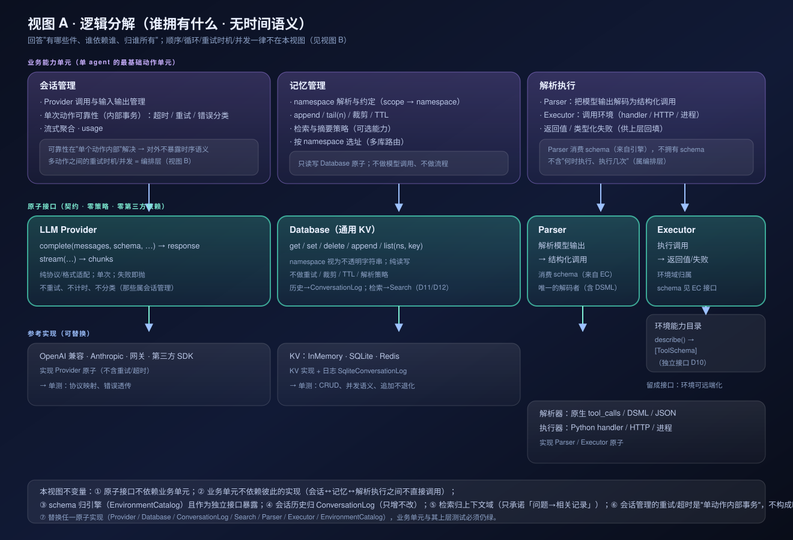
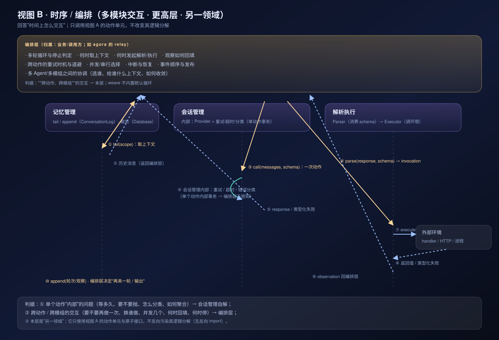

# Weave 架构：两个视图（逻辑分解 / 时序编排）

> 核心结论：**逻辑分解**与**时间交互**是两个领域，必须分开建模。
> 当前组件集合实现的是**单 agent 的最基础动作单元**；"组件之间时间上如何交互"属于更上层的编排领域。

## 视图 A · 逻辑分解（谁拥有什么 · 无时间语义）

| 层 | 组成 | 拥有什么 | 明确不做 |
|---|---|---|---|
| 业务能力单元（单 agent 最基础动作单元） | **会话管理** | Provider 调用、输入输出管理、**单次动作可靠性（超时/重试/错误分类，内部事务）**、流式聚合、usage | 不决定跨动作流程 |
| | **记忆管理** | namespace 解析与约定、append/tail、裁剪、TTL、检索/摘要策略、按 ns 选址 | 不调模型、不做流程 |
| | **解析执行** | Parser 解码模型输出、Executor 调环境、返回值/类型化失败 | 不决定"何时执行、执行几次" |
| 原子接口（契约） | **LLM Provider** | 协议/格式适配；单次；失败即抛 | 不重试、不计时、不分类 |
| | **Database** | `(namespace, key)` 纯读写（ns 不透明） | 不重试/裁剪/TTL/检索/解析 |
| | **Parser** | 把模型输出解码为结构化调用（**消费** schema） | 不拥有环境、schema |
| | **Executor** | 执行调用、产出返回值/失败；**环境域归属**（schema 由此暴露） | 不做流程控制 |
| 引擎/环境接口 | **EnvironmentCatalog** | `describe() -> [ToolSchema]`（**schema 特化于环境，环境是引擎的**） | — |

不变量：
1. 原子接口不依赖业务单元；业务单元之间**不互相调用实现**（会话↔记忆↔解析执行）；
2. **schema 由引擎持有**并作为接口暴露（环境可远端化）；
3. 会话管理的重试/超时是"**单动作内部事务**"，对外不暴露时序语义；
4. 替换任一原子实现（Provider / Database / Parser / Executor），业务单元与上层测试必须仍绿。

## 视图 B · 时序 / 编排（多模块交互 · 更高层 · 另一领域）

编排层（归属：业务/调用方；**agora 的 relay 就在这一层**）负责：
- 多轮循环与停止判定、何时取上下文、何时发起解析/执行、观察如何回填；
- **跨动作**的重试时机与退避、并发/串行选择、中断与恢复、事件顺序；
- 多 Agent / 多模组之间的协调（选谁、给谁什么上下文、如何收敛）。

weave **不内置默认循环**；编排层只使用视图 A 的动作单元与原子接口，不反向污染其逻辑分解。

## 判据（一句话记）

> **单个动作"内部"的问题（等多久 / 要不要抛 / 怎么分类 / 怎么聚合） → 会话管理；**
> **跨动作、跨模组的交互（要不要再做一次 / 换谁做 / 并发几个 / 何时回填 / 何时停） → 编排层。**

## 决策记录

| # | 决策 | 结论 |
|---|---|---|
| D1 | 重试/超时/异常分类归属 | **会话管理**（单个动作内部问题）；编排层只处理多模块交互 |
| D2 | schema 归属 | **引擎（环境域）**持有，并以接口（`describe()`）暴露；Parser 只消费 |

## 相对现状（重构清单）

| 项 | 现状 | 目标 |
|---|---|---|
| Provider | 内嵌重试/超时/分类 | **去策略**，变哑（策略上移会话管理） |
| Database | StateStore（含可选能力协议） | 纯 `(ns,key)` 读写；能力协议按需保留为可选接口 |
| 工具 | 单一 `ToolRegistry`（合并解码+执行） | **拆为 Parser + Executor**，schema 经 EnvironmentCatalog 暴露 |
| 业务层 | Agent/loop/context（已移出包） | 三个能力单元：会话管理 / 记忆管理 / 解析执行（参考配方） |
| 编排 | 曾经想放进 Loop | **独立成层**：weave 不内置，业务自写（agora relay 是范例） |

## 替换测试（层的质量门禁）

- 换 `Database`（InMemory↔SQLite↔Redis）：记忆管理 + 上层测试全绿；
- 换 `Provider`（OpenAI 兼容↔Fake↔第三方 SDK）：会话管理策略不变，上层测试全绿；
- 换 `Parser`（原生 tool_calls↔DSML↔JSON）：解析执行行为在契约内一致；
- 换 `Executor`（Python handler↔HTTP）：返回值/失败语义不变；
- 反向依赖为 0：原子层源码不出现业务单元/编排层符号。
