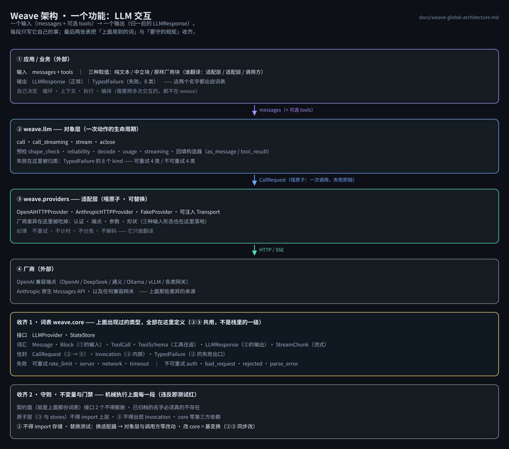

# Weave 全局架构

> **一句话**：weave 只做**一个维度**——LLM 交互。对外**一个输入、一个输出**；
> 上下文从哪来、工具怎么执行、循环几轮，**都是应用的自由**。



设计哲学单独一张图：[`weave-design-philosophy.svg`](./weave-design-philosophy.svg)
（先验 · 判决规则 · 哑原子/聪明对象 · core 是词表 · 两种内容形态 · 不许静默）。
两图都由 `python scripts/render_design_svg.py` 生成，**零依赖**（手写 SVG）且带排版自校验。

## 1. 三层 + 一张词表

```
① 应用 / 业务（外部）—— 编排与组合都在这里
│    自己决定：上下文从哪来 · 工具怎么执行 · 循环几轮 · 什么时候停
│      │  messages（+ 可选 tools）
│      ▼
② weave.llm(...) —— 对象：LLM 交互（weave 唯一功能）
│    对外四个方法：call · call_streaming · stream · aclose
│    发请求前预检（适配层自述厂商）· reliability · decode · usage · observer
│      │  CallRequest（哑原子：一次调用，失败即抛）
│      ▼
③ 厂商适配层 —— LLMProvider 实现（可替换 · 不进兼容承诺）
     OpenAIHTTPProvider · AnthropicHTTPProvider · FakeProvider · 可注入 Transport
════════════════════════════════════════════════════════════════════
   契约与词汇（weave.core）—— ②③ 共用的词表，**不是栈里的一级**
     接口  LLMProvider · StateStore
     词汇  Message · ToolCall · ToolSchema · LLMResponse · StreamChunk
     信封  CallRequest · Invocation · TypedFailure
     失败  8 类，kind 与 retryable 必须一致
     规则  payload_content：str=语义形态 / dict·list[dict]=原样形态
════════════════════════════════════════════════════════════════════
```

**core 的位置**：它不是"压在底下的一层"，而是**对象与适配层两侧共用的词表**——
两条"依赖"箭头指向它，它自己不指向任何 weave 模块（`Ca=3, Ce=0, I=0.00`，全包最稳定）。
改动 core = **基变换**：② 和 ③ 必须同步改，替换测试会拦住不同步的那次。

## 2. 对外 API

```python
import weave

w = weave.llm(model="deepseek-chat", timeout=30, retry=3, observer=None)
# 默认装配零第三方依赖的 OpenAIHTTPProvider；
# 需要测试 / 私有厂商 / 另一家协议时：
#   weave.llm(model="claude-sonnet-4-20250514", protocol="anthropic")
#   weave.llm(provider=MyProvider())
resp = await w.call(messages, tools=[...], max_tokens=2048)
resp.content, resp.tool_calls, resp.usage, resp.finish_reason
resp.attempts, resp.elapsed_ms          # 这个动作试了几次、花了多久
resp.raw, resp.raw_blocks               # 厂商原始片段 / 原始内容块（不丢块）

async for chunk in w.stream(messages): ...              # 只要增量（自行组装）
resp = await w.call_streaming(messages, on_chunk=...)   # 流式 + 内部聚合
await w.aclose()
```

**输入两种内容形态**（`Message.content`）：

| 形态 | 写法 | 谁翻译 | 可移植性 |
|---|---|---|---|
| 语义形态 | `content="你好"` | weave（适配层） | **跨厂商**：换 provider 调用方零改动 |
| 原样形态 | `content=[{"type": "image", ...}]` | 调用方 | 仅当前厂商；换 provider 需改写 |

原样形态是接厂商独有能力的**唯一入口**（多模态、`cache_control`、thinking 回传、厂商新块），
weave 不解释任何 key。适配层按**配置选定的厂商**拦"别家已知形状"的块（未知块一律放行，
`shape_check=False` 可关）——厂商知识只在 ③，`Message` 里没有厂商名。

完整规格与逐条验收清单：**`docs/weave-llm-dimension.md`**。

## 3. 不变量与门禁

**不变量**

1. 对象只认识 `LLMProvider`（哑原子）；循环 / 上下文 / 执行 / 编排都不在对象里；
2. 适配层是哑的：不重试 · 不计时 · 不分类 · 不解码 · 不知道策略；
3. 失败一律 `TypedFailure`（`kind` 与 `retryable` 必须一致，可重试 4 类 / 不可重试 4 类）；
4. 可观测性只有一条通道：注入的回调 `observer=`；对象自己不写日志、不埋点；
5. 无全局可变状态：配置只在构造器与实例属性上；
6. `Message` 与 `weave.core` **不认识任何厂商**。

**门禁（`tests/v04/test_contracts.py`，CI 机械执行）**

- 接口面只保留**真有消费者**的两个名字（`LLMProvider` · `StateStore`），
  已归档的接口与包**必须真的不存在**（名单在测试文件里）；
- `weave.__all__` 只允许五个名字，防止公共面悄悄膨胀；
- 原子层（core / stores / providers）不得 import 上层（`weave.llm` / `demos`）；
- `weave/llm` 不得 import 存储或已归档模块；
- `core` 零第三方依赖；`providers` 不得出现 `Invocation`（原子不解码）；
- **替换测试**：换 provider（`OpenAIHTTPProvider` ↔ `AnthropicHTTPProvider` ↔ `FakeProvider`）
  → 对象层与应用零改动（`str` 形态下成立）。

## 4. 怎么跑

```bash
python -m pytest tests/v04 -q                 # 全离线：假 transport，不联网、不需要 API key
python scripts/render_design_svg.py           # 重画两张图（含排版自校验）
```
