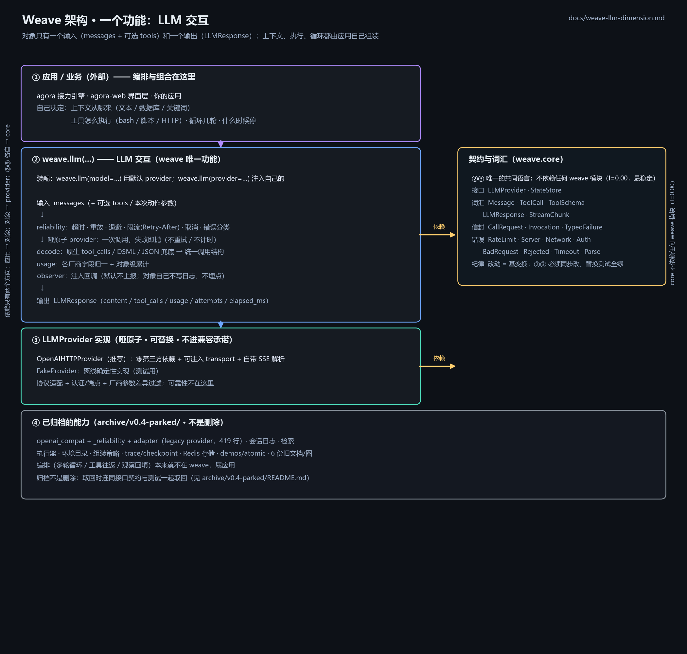

# Weave 全局架构（v0.4 · 现状）

> **一句话**：weave 只做**一个维度**——LLM 交互。对外**一个输入、一个输出**；
> 上下文从哪来、工具怎么执行、循环几轮，**都是应用的自由**。



旧的"对象 = 四个原子 + 一整套策略 + 默认编排"那份设计已作废：
`weave-view-a-logical.svg` / `weave-view-b-temporal.svg` 描述的是**过去**的形态，
保留仅作历史参考；当前形态以本文与 `docs/weave-llm-dimension.md` 为准。

## 1. 分层

```
┌─ 左列：依赖自上而下 ────────────────────────┐   ┌─ 右侧：两侧共用的词表 ──────┐
│ ① 应用 / 业务（外部）：编排与组合都在这里   │   │ 契约与词汇（weave.core）     │
│    └─ 自己决定：上下文从哪来、工具怎么执行、 │   │   接口 LLMProvider·StateStore│
│       循环几轮                              │──▶│   词汇 Message/ToolCall/     │
│         │  messages（+ 可选 tools）         │   │        ToolSchema/LLMResponse│
│         ▼                                   │   │        /StreamChunk          │
│ ② weave.llm(...) —— LLM 交互（唯一功能）    │   │   信封 CallRequest/Invocation│
│    对外：call(messages, tools=…) → LLMResponse│  │        /TypedFailure         │
│    内部：reliability（超时/重放/退避/限流/  │   │   错误 RateLimit/Server/     │
│          取消/分类）· decode（原生/DSML/JSON）│  │        Network/Auth/…        │
│          · usage（归一+累计）· observer     │   │   纪律 改动=基变换，②③ 同步改│
│         │  哑原子：一次调用，失败即抛        │   │                             │
│         ▼                                   │   │   它不依赖任何 weave 模块    │
│ ③ LLMProvider 实现（可替换 · 不进承诺）     │──▶│   （I=0.00，最稳定）         │
│    OpenAIHTTPProvider（零依赖 + 可注入      │   │                             │
│      transport + SSE）· FakeProvider        │   └─────────────────────────────┘
│    `weave.llm(model=…)` 默认装配前者；      │
│    `weave.llm(provider=…)` 可注入自己的实现 │
└─────────────────────────────────────────────┘
  ④ 已归档的能力（archive/v0.4-parked/）—— 会话日志 · 检索 · 执行器 · 环境目录 ·
     组装策略 · trace/checkpoint · Redis 存储 · legacy provider(419 行) · demos/atomic
```

**注意 `weave.core` 的位置**：它不是"压在底下的一层"，而是**对象与 provider 两侧共用的词表**
（两条"依赖"箭头指向它，它自己不指向任何 weave 模块）。改它的地方叫"基变换"：
② 和 ③ 必须同步改，替换测试会拦住不同步的。

图示：`docs/weave-global-architecture.png`（渲染图）· `.mmd`（mermaid 源码）·
`scripts/render_architecture_{ascii,png}.py`（重生成脚本，带排版自校验）。

## 2. 对外 API

```python
import weave

w = weave.llm(model="deepseek-chat", timeout=30, retry=3, observer=None)
# 默认装配零第三方依赖的 OpenAIHTTPProvider；
# 需要测试或私有厂商时：weave.llm(provider=MyProvider())
resp = await w.call(messages, tools=[...], max_tokens=2048)
resp.content, resp.tool_calls, resp.usage, resp.finish_reason
resp.attempts, resp.elapsed_ms          # 这个动作试了几次、花了多久

async for chunk in w.stream(messages): ...              # 只要增量（自行组装）
resp = await w.call_streaming(messages, on_chunk=...)   # 流式 + 内部聚合
await w.aclose()
```

完整规格与逐条验收清单：**`docs/weave-llm-dimension.md`**。

## 3. 归档的能力（`archive/v0.4-parked/`，不是删除）

判据只有一条：**有没有真实消费者**。清点后留下的四个名字都有明确使用方：

| 保留 | 谁在用 |
|---|---|
| `LLMProvider` | LLM 交互对象（唯一契约）；`OpenAIHTTPProvider` / `FakeProvider` 实现它 |
| `StateStore` | `SQLiteStateStore` / `InMemoryStateStore` |

其余接口与实现只有它们自己的测试在用，因此**整体归档**（详见 `archive/v0.4-parked/README.md`）：

| 已归档 | 原定位 |
|---|---|
| `weave/logs/` · `weave/search/` | 会话日志（O(1) 追加）· 检索（RAG 落点） |
| `weave/executors/` · `weave/catalogs/` | 执行器 · 环境目录（schema 反射） |
| `weave/strategy/` | 组装策略（记忆读写 / 上下文拼装） |
| `weave/capabilities/` · `core/codec.py` · `stores/redis_store.py` | trace/checkpoint · 编解码 · Redis 存储 |
| `demos/atomic/` | 面向旧形态的 Agent/loop/context/tool_registry 示例 |
| 5 个测试文件 + 4 份旧文档/图 | 与上述代码一同搬家 |

将来要做那些维度时从归档取回——取回时要**连同接口契约与测试一起**取回，
并且先想清楚"它是否真的属于 LLM 交互"（按当前判据，上下文/执行/编排都不属于）。

## 4. 决策状态

| # | 决策 | 状态 |
|---|---|---|
| D1 | 重试/超时/分类属"单动作内部事务" | ✅ 落在 `weave.llm.reliability` |
| D5 | 配置形态：构造器 + 实例属性 + 无全局可变状态 | ✅ |
| D13 | 解码只有一处 | ✅ 落在 `weave.llm.decode`（原子不解码） |
| D14 | 对象不拼装消息、不碰存储 | ✅（更彻底：对象不认识存储） |
| D15 | 判据：同一请求的重放 = 本维度；变更输入的再一次动作 = 应用 | ✅ |
| D18 | 可观测性 = 注入回调；对象不写日志不埋点 | ✅ |
| D2 / D10 | schema 归"引擎"、以 `describe()` 暴露 | 📦 随 `catalogs`/`executors` 归档 |
| D3 / D6 / D7 / D8 | 记忆默认行为 · `prompts`/`context` 语义 · 命名约定在策略层 | 📦 随 `strategy` 归档 |
| D11 / D12 | `ConversationLog` / `Search` 作为契约接口 | 📦 归档（接口与实现一起） |
| D4 / D9 / D16 / D17 | `run()` 默认编排 · `RunResult` · `prompts`/`initial` · 薄委托 | ❌ 不再存在：循环与输入都归应用 |

## 5. 不变量与门禁

**不变量**
1. 对象只认识 `LLMProvider`（哑原子）；上下文/执行/编排都不在对象里；
2. 原子是哑的：不重试、不计时、不分类、不解码；
3. 失败一律 `TypedFailure`（`kind` 与 `retryable` 必须一致）；
4. 可观测性只有一条通道：注入的回调 `observer=`；
5. 无全局可变状态：配置只在构造器与实例属性上。

**门禁（`tests/v04/test_contracts.py`，CI 机械执行）**
- 接口面只保留有消费者的四个名字；已归档的接口/包**必须真的不存在**
  （`Database`/`ConversationLog`/`Search`/`Executor`/`EnvironmentCatalog`/
  `ToolRegistry`/三个可选存储协议/`Parser`，以及 `weave.logs` 等模块）；
- `weave.__all__` 只允许五个名字（防止公共面悄悄膨胀）；
- 原子层（core / stores / providers）不得 import 上层（`weave.llm` / `demos`）；
- `weave/llm` 不得 import 存储或已归档模块；
- `core` 零第三方依赖；`providers` 不得出现 `Invocation`（原子不解码）；
- 替换测试：换 provider（`OpenAIHTTPProvider` ↔ `FakeProvider`）→ 对象层与应用零改动。

## 6. 怎么跑

```bash
python -m pytest tests/v04 -q                 # weave 自己的测试（全离线）
python scripts/render_architecture_png.py     # 重画架构图（含排版自校验）
python scripts/render_architecture_ascii.py   # 终端版架构图
```
